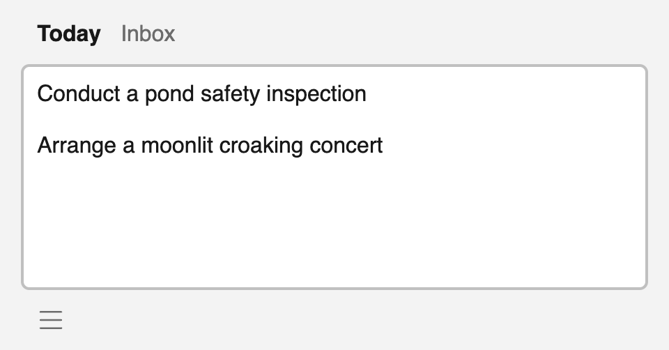

# Frogtab — Private, peaceful task management

[Frogtab](https://frogtab.com) is a lightweight task manager that helps you stay focused on today's priorities.

<p></p>

Learn more about Frogtab:

  - [Full docs](https://frogtab.com/help)
  - [Dev blog](https://maybecoding.bearblog.dev/blog/)

In this README:

  - [Data flow](#data-flow)
  - [JavaScript SDK](#javascript-sdk)
  - [Acknowledgments](#acknowledgments)
  - [License](#license)

## Data flow

Your data is stored in your browser's `localStorage`.

Frogtab can't sync data between devices. However, if you [register your main device](https://frogtab.com/help#registering-for-a-personal-link), you can send tasks to your main device from any device.
This feature uses a server to relay tasks to your main device.

More details:

 1. When you register your main device, Frogtab generates a PGP key pair in your browser.

    Frogtab then sends the public key to the server.
    The private key never leaves your main device.

    See the `register` function in [help.html](app/help.html).

 2. The server generates a user ID and an API key for your main device:

      - **User ID** - The public "address" of your main device
      - **API key** - A non-public "password" for your main device

    See [post-create-user.php](app/open/post-create-user.php).

 3. Frogtab creates a personal link `https://frogtab.com/send#{id}`, where `{id}` is the user ID from step 2.

    You can use your personal link to send tasks to your main device.

 5. When you send a task to your main device, Frogtab first encrypts the task using the public key from step 1.
    Frogtab then sends the encrypted task to the server.

    See the `encryptAndSend` function in [send.html](app/send.html).

 7. The server queues the encrypted task.

    See [post-add-message.php](app/open/post-add-message.php).

  8. Frogtab on your main device periodically checks for encrypted tasks.

     The server requires the API key from step 2. This ensures that only your main device is permitted to check for encrypted tasks.
     If there are encrypted tasks in the queue, your main device downloads the encrypted tasks.

     The server clears the queue as soon as your main device has downloaded the encrypted tasks.

     See [post-remove-messages.php](app/open/post-remove-messages.php).

 9. Frogtab decrypts the tasks using the private key from step 1.

    See the `verifyUserAndAppendMessages` function in [main.js](app/main.js).

## JavaScript SDK

If you have [registered your main device](https://frogtab.com/help#registering-for-a-personal-link), you can use the JavaScript SDK to send messages to Frogtab on your main device.
For example:

```javascript
let encryptAndSend = null;

async function send(message) {
  try {
    if (!encryptAndSend) {
      const frogtab = await import("https://frogtab.com/open/sdk.js");
      encryptAndSend = await frogtab.connectToInbox("USER ID GOES HERE");
    }
    return await encryptAndSend(message);
  }
  catch (err) {
    return false;
  }
}

send("Hello Frogtab!").then(success => {
  console.log(success);
});
```

Replace `USER ID GOES HERE` by the ID from the URL of your personal link.

To learn more, see [this blog post](https://maybecoding.bearblog.dev/adding-a-private-feedback-box-to-bear/).

## Acknowledgments

  - [Simple.css](https://simplecss.org)
  - [OpenPGP.js](https://openpgpjs.org)
  - [ramsey/uuid](https://uuid.ramsey.dev)
  - [iconnoir](https://iconoir.com)
  - [mackwhyte](https://www.fiverr.com/mackwhyte)

## License

Frogtab is licensed under the MIT License.
For details, see [LICENSE](LICENSE).

Frogtab uses OpenPGP.js for PGP encryption and decryption.
OpenPGP.js is licensed under the GNU Lesser General Public License.
For details, see [LICENSE_openpgp](LICENSE_openpgp).
The source code of OpenPGP.js is available at https://github.com/openpgpjs/openpgpjs.