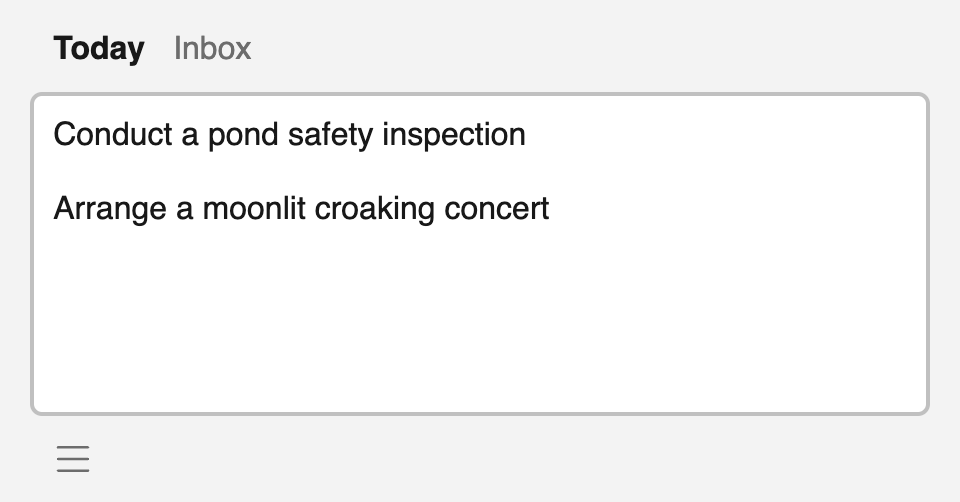

# Frogtab — Private, peaceful task management

Frogtab is a lightweight task manager that helps you stay focused on today's priorities.

<p></p>

Frogtab runs in your browser and stores your data in [`localStorage`](https://developer.mozilla.org/en-US/docs/Web/API/Window/localStorage).
You can export your data at any time.
If your browser supports [`showSaveFilePicker()`](https://developer.mozilla.org/en-US/docs/Web/API/Window/showSaveFilePicker), you can also enable automatic backups.

Frogtab can't sync your data between devices.
However, if you [register your main device](https://frogtab.com/help#registering-for-a-personal-link),
the frogtab.com server creates a personal link that you can use to send tasks to your main device.

In this README:

  - [Using Frogtab offline](#using-frogtab-offline)
  - [How your personal link works](#how-your-personal-link-works)
  - [Customizing the placeholder text of your personal link](#customizing-the-placeholder-text-of-your-personal-link)
  - [Sending tasks via JavaScript](#sending-tasks-via-javascript)
  - [Self-hosting Frogtab](#self-hosting-frogtab)
  - [Acknowledgments](#acknowledgments)
  - [License](#license)
  - [Changelog](#changelog)

From my dev blog:

  - [Running the Frogtab task manager on Ubuntu](https://maybecoding.bearblog.dev/running-the-frogtab-task-manager-on-ubuntu/)
  - [Making a command-line tool for your Frogtab personal link](https://maybecoding.bearblog.dev/making-a-command-line-tool-for-your-frogtab-personal-link/)

## Using Frogtab offline

Frogtab Local is a version of [frogtab.com](https://frogtab.com) that you can run on your computer. With Frogab Local, you can:

  - Use Frogtab offline
  - Enable automatic backups in any browser
  - Send tasks to Frogtab via a terminal

To set up Frogtab Local, [download and run the latest release](https://github.com/dwilding/frogtab/releases).
If you use Linux, it's easier to [install Frogtab Local from the Snap Store](https://snapcraft.io/frogtab).

## How your personal link works

 1. When you register your device, Frogtab generates a PGP key pair in your browser.
    Your device then sends the public key to the server.
    The private key never leaves your device.

    See `register()` in [help.html](app/help.html).

 2. The server generates a user ID and an API key for your device:

      - **User ID** - The public "address" of your device
      - **API key** - A non-public "password" for your device

    See [post-create-user.php](server/public/open/post-create-user.php).

    Your personal link is `https://frogtab.com/send#{id}`, where `{id}` is the user ID.

 3. When you use your personal link to send a task, Frogtab first encrypts the task using the public key from step 1.
    Frogtab then sends the encrypted task to the server.

    See `encryptAndSend()` in [send.html](app/send.html).

 4. The server queues the encrypted task.

    See [post-add-message.php](server/public/open/post-add-message.php).

 5. Your device periodically checks for encrypted tasks.

    The server requires the API key from step 2. This ensures that other devices cannot check for encrypted tasks.
    If there are encrypted tasks in the queue, your device downloads the encrypted tasks.

    The server clears the queue as soon as your device has downloaded the encrypted tasks.

    See [post-remove-messages.php](server/public/open/post-remove-messages.php).

 6. Your device decrypts the tasks using the private key from step 1.

    See `verifyUserAndAppendMessages()` in [main.js](app/main.js).

## Customizing the placeholder text of your personal link

By default, the placeholder text of your personal link is "Add a task to your inbox…".
You can override the default placeholder text to help you identify the device that you're sending tasks to.

To override the default placeholder text, add `/{text}` to the end of your personal link, where `{text}` is your preferred placeholder text.
Make sure that any special characters in the placeholder text are correctly [percent-encoded](https://developer.mozilla.org/en-US/docs/Glossary/Percent-encoding) in your personal link.
For example, to use "Send to Linux desktop…" as the placeholder text, add `/Send%20to%20Linux%20desktop%E2%80%A6` to the end of your personal link.

To override the default placeholder text and automatically use the correct encoding, open your personal link in your browser, then run `setPlaceholder("Custom placeholder text")` in the web console.

## Sending tasks via JavaScript

After registering your device, you can use the JavaScript SDK to send tasks to your device:

```javascript
let encryptAndSend = null;

async function send(task) {
  try {
    if (!encryptAndSend) {
      const frogtab = await import("https://frogtab.com/open/sdk.js");
      encryptAndSend = await frogtab.connectToInbox("YOUR_ID");
    }
    return await encryptAndSend(task);
  }
  catch (err) {
    return false;
  }
}

send("Record a demo video").then(success => {
  console.log(success);
});
```

Replace `YOUR_ID` by the ID from your personal link.

For a detailed example, see [Adding a private feedback box to Bear](https://maybecoding.bearblog.dev/adding-a-private-feedback-box-to-bear/).

## Self-hosting Frogtab

You'll need an Apache server that has PHP and [Composer](https://getcomposer.org/) installed.
Apache must have the following modules enabled:

  * mod_mime
  * mod_rewrite
  * mod_headers

To install Frogtab on your own server:

 1. Open a shell on your server, then navigate to a directory that is accessible to PHP scripts but not accessible via the web.

 2. Run the following commands:

    ```
    git clone https://github.com/dwilding/frogtab.git
    cd frogtab
    ./dev_build_server.sh
    ```

 3. Copy the contents of *frogtab/server/public* to a directory that is accessible via the web.
    Make sure that the *.htaccess* files in *frogtab/server/public* and *frogtab/server/public/open* are copied.

Frogtab is ready!

To use Frogtab, open your browser, then navigate to the web-accessible directory from step 3.

The first time you register a device, Frogtab creates a SQLite database called *frogtab.db* in the directory from step 1.
This database stores device credentials and the queue of encrypted tasks.

## Acknowledgments

  - [Simple.css](https://simplecss.org)
  - [OpenPGP.js](https://openpgpjs.org)
  - [ramsey/uuid](https://uuid.ramsey.dev)
  - [iconnoir](https://iconoir.com)
  - [mackwhyte](https://www.fiverr.com/mackwhyte)

## License

Frogtab is licensed under the MIT License.
For details, see [LICENSE](LICENSE).

Frogtab uses OpenPGP.js for PGP encryption.
The source code of OpenPGP.js is available at https://github.com/openpgpjs/openpgpjs.
OpenPGP.js is licensed under the GNU Lesser General Public License.
For details, see [LICENSE_openpgp](LICENSE_openpgp).

## Changelog

| Date | Change | Available in Server | Frogtab Local Version |
| --- | --- | --- | --- |
| Nov ?, 2024 | The `frogtab` command now displays a status message if Frogtab Local is already running (Linux snap only) | No | v1.09 |
| Nov ?, 2024 | You can now use ⌘+X (macOS) or Ctrl+X (Windows/Linux) to cut tasks when no text is selected | Yes | v1.09 |
| Nov ?, 2024 | Prevented Frogtab from overriding keyboard shortcuts that use the Option key (macOS) or the Alt key (Windows/Linux) | Yes | v1.09 |
| Nov ?, 2024 | Prevented the Control key from activating Frogtab's keyboard shortcuts on macOS | Yes | v1.09 |
| Nov ?, 2024 | Changed the format of dates in backup files. You can still import old backup files | Yes | v1.09 |
| Nov 2, 2024 | Sending tasks via a terminal now fails if the label has never been used by Frogtab | No | v1.08 |
| Oct 27, 2024 | You can now send tasks to Frogtab via a terminal, without registering for a personal link. See the help page | No | v1.07 |
| Oct 18, 2024 | You can now stop Frogtab Local via your browser. See the bottom of the help page | No | v1.06 |
| Oct 18, 2024 | Reorganized the menu to always show Achievements. Removed Send to Frogtab from the menu | Yes | v1.06 |
| Oct 18, 2024 | Reorganized the help page and explained Achievements in a more approachable way | Yes | v1.06 |
| Oct 18, 2024 | Improved keyboard accessibility | Yes | v1.06 |
| Oct 18, 2024 | Changed the ID format of generated key pairs, for better compatibility with GnuPG | Yes | v1.06 |
| Oct 18, 2024 | Improved portability by specifying the content type for *.mjs* files | Yes | Not applicable |
| Sep 25, 2024 | You can now download public keys from the server. See [code_samples.md](code_samples.md) | Yes | Not applicable |
| Jul 30, 2024 | Fixed a registration bug that occurred after reinstalling Frogtab on the server | Yes | Not applicable |
| Jul 26, 2024 | Added a variable in *config.py* that specifies the server to use for personal links | No | v1.05 |
| Jul 26, 2024 | Fixed a registration bug that occurred after importing an old backup file | Yes | v1.05 |
| Jul 16, 2024 | Changed the Flask app to run via Python instead of the `flask` command. The port is now specified in *config.py* | No | v1.04 |
| Jul 16, 2024 | Changed the name of the built-in backup method to show the backup directory instead of the filename | No | v1.04 |
| Jul 16, 2024 | Identified the registration server in "Registering for a personal link" on the help page | Yes | v1.04 |
| Jul 16, 2024 | Removed the `data-vibe` attribute and documented how to [customize the placeholder text of your personal link](#customizing-the-placeholder-text-of-your-personal-link) | Yes | v1.04 |
| Jul 4, 2024 | Improved support & docs for self-hosted servers | Yes | v1.03 |
| Jul 2, 2024 | Fixed a bug with the registration button | Yes | v1.02 |